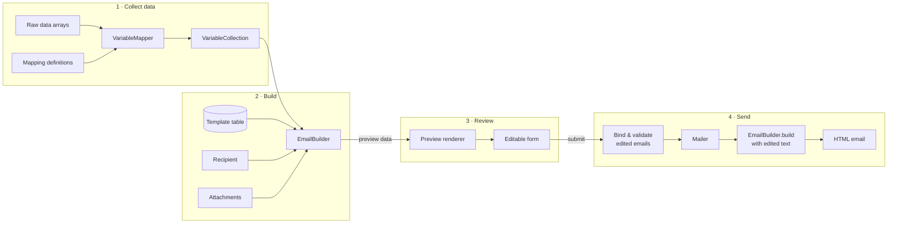

# Template-Driven Email Notifications with Review Before Sending (TYPO3)

> A technical case study of a module I designed and implemented for a membership administration platform
> built on TYPO3 12 LTS. Domain-specific names, tables and fields have been replaced with generic ones;
> the architecture and code structure are unchanged.
>
> The source code itself is not public. This document is meant to stand on its own: the key parts are shown
> as short excerpts, and every class or method name is explained where it first appears.

## 1. The Problem in Plain Terms

The platform is used by an organisation's **office staff** to manage people and their applications, such
as membership changes, permits or certificates. Many of their everyday actions should **send an email to the
person concerned**. Examples:

- *"Your application has been approved."*
- *"We have updated your contact details. Please check them."*
- *"Your certificate expires on 31.03. Here is how to renew it."*

These emails have three requirements:

1. **The office writes the wording, not the developers.** Staff keep a library of **email templates** in
   the admin interface: sender, subject and a rich-text body. The body contains **placeholders** that the
   system fills in for each recipient:

   ```text
   Subject: Your application ###Application:Number### has been approved

   Dear ###Person:FirstName### ###Person:LastName###,
   your application is valid until ###Application:ValidUntil###.
   ```

2. **Every email can be checked and adjusted before it goes out.** Each case is different, so staff
   want to review the message and sometimes add a personal sentence.

3. **Several emails go out in one step.** For example, when staff approve a request, both the applicant
   and a contact person may be notified.

**What the user experiences:**

```text
 Staff clicks "Approve & notify"
        │
        ▼
 ┌──────────────────────────────────────────────────────────┐
 │ Preview page – one editable block per email              │
 │                                                          │
 │  From:    Office <office@example.org>                    │
 │  To:      Jane Doe <jane@example.org>                    │
 │  Subject: [Your application 4711 has been approved    ]  │
 │  Text:    [Dear Jane Doe, your application is valid   ]  │
 │           [until ???Application:ValidUntil???.        ]  │  ← missing data is highlighted
 │                                                          │
 │                                          [ Send ]        │
 └──────────────────────────────────────────────────────────┘
        │
        ▼
 The edited input is checked, the action is carried out, and the emails are sent.
 Any placeholder that is still unresolved is removed, so a recipient never sees "???…???".
```

This write-up describes the PHP module behind that flow: about **60 small classes (~2.6k lines)**, written
in PHP 8.2 with strict types and checked with PHPStan. Several admin workflows use it. Each one only has to
say **who** gets the email, **which template** to use and **which data** to fill in.

### A few terms used below

- **TYPO3** is a PHP content management system. **Extbase** is its MVC framework (controllers, actions,
  form-to-object mapping, validation). **Fluid** is its HTML template engine.
- **Template** is the email text that staff maintain, stored in a database table.
- **Variable / placeholder** is a token such as `###Person:FirstName###` that gets replaced with real data.
- **Preview** is the editable page shown before sending.
- **`GeneralUtility::makeInstance(Foo::class)`** is TYPO3's way of creating an object. In the excerpts
  you can read it as `new Foo()`.
- **`FluidEmail`** is TYPO3's email class that renders HTML through a Fluid layout. **`Address`** is an
  email address with an optional display name, e.g. `Jane Doe <jane@example.org>`.
- Many methods return the object itself, so calls can be chained:
  `$email->setTo(…)->setTemplateIdentifier(…)`.

## 2. Technical Constraints

- **Templates live in an existing database table.** Each row holds the sender name and address, subject,
  HTML body and an optional BCC address. Templates are looked up by name and must be active.
- **The data comes from an older database** as plain associative arrays, not as objects. The same value
  (e.g. a person's ID) can sit in different tables depending on the workflow.
- **Missing data must be obvious in the preview** but must **never reach the recipient**.
- **The HTML body must be sanitised** before sending, because staff can edit it.
- **One reusable flow** (build → preview → edit → validate → send) that each workflow can use without
  writing its own version.

## 3. Architecture Overview



The module is split into the following parts (folders):

| Part                   | Responsibility                                                                     |
|------------------------|------------------------------------------------------------------------------------|
| `Variables\Mapping`    | Declares which placeholder is filled from which database field                     |
| `Variables\Extraction` | Reads a field from a data source (currently arrays)                                |
| `Variables\Converter`  | Transforms values, e.g. dates into the local format                                |
| `Variables\Processing` | Replaces placeholders in subject (plain text) and body (HTML)                      |
| `Attachment`           | File attachments, either from memory or from disk                                  |
| `Recipient`            | Turns a person or organisation record into an email address with a display name    |
| `EmailBuilder`         | Combines template, recipient, data and attachments into a ready-to-send email      |
| `Preview`              | Data and HTML rendering for the review page                                        |
| `Property`, `Validator`| Turns the submitted review form back into objects and checks them                  |
| `Mailer`               | Sends, and logs failures without stopping the rest of the batch                    |

## 4. Component Deep Dives

### 4.1 Filling Placeholders: A Small Declarative Mapping Language

**Problem:** staff use placeholders such as `###Person:FirstName###`, but the data sits in various tables
with technical column names, and some values need formatting (dates).

**Solution:** each subject area (person, organisation, application, …) declares its placeholders in one
small class. Each placeholder is described by a `VariableDefinition`, which holds three things:

- its **name**, as staff write it in the template
- **one or more sources**: a data set name (e.g. `person`) and a field in it, in order of preference
- optionally, a **chain of converters** that transform the value

```php
class PersonMapping implements VariableMapping
{
    // VariableMapping: "a class that returns a list of VariableDefinitions"

    public function getVariables(): array
    {
        $dateConverter = new DateTimeConverter('Y-m-d H:i:s', 'd.m.Y');

        return [
            VariableDefinition::create('Person:Id')
                ->addSource('person', 'id')
                ->addSource('membership', 'person_id'),
            VariableDefinition::create('Person:FirstName')
                ->addSource('person', 'first_name'),
            VariableDefinition::create('Person:MemberSince')
                ->addSource('membership', 'valid_from')
                ->addConverter($dateConverter),
        ];
    }
}
```

Here, `Person:Id` is read from the `person` data if the workflow provides it, and otherwise from the
`membership` data. `Person:MemberSince` turns a database date such as `2024-03-01 00:00:00` into `01.03.2024`.

The `VariableMapper` checks these definitions against the data the current workflow has. That data is
passed in as `$sources`: an array of data set name → database row. The extractor reads one field from one
row. The **first source that is present and non-empty wins**, and its value runs through the converters:

```php
public function map(array $sources, VariableMapping $mapping, DataExtractor $extractor): array
{
    $variables = [];
    foreach ($mapping->getVariables() as $variableDefinition) {
        foreach ($variableDefinition->getSources() as $sourceIdentifier => $field) {
            if (!isset($sources[$sourceIdentifier])) {
                continue;
            }
            $extractedValue = $extractor->extract($field, $sources[$sourceIdentifier]);
            if (empty($extractedValue)) {
                continue;
            }
            foreach ($variableDefinition->getConverters() as $converter) {
                $extractedValue = $converter->convert($extractedValue);
            }
            $variables[$variableDefinition->getName()] = $extractedValue;
            break;
        }
    }
    return $variables;
}
```

The result is a plain array of placeholder name → value, e.g. `['Person:FirstName' => 'Jane', …]`. It is
then wrapped in a `VariableCollection`, a small key/value store with three questions: `has($name)`,
`get($name)` and `ignore($name)` (see 4.2).

Mappings can be **combined**, so a workflow can offer person and organisation placeholders together:

```php
$mapping = CombinedMapping::create()
    ->addMapping(PersonMapping::create())
    ->addMapping(OrganisationMapping::create());

$variables = $mapper->map(
    ['person' => $personRow, 'organisation' => $organisationRow],
    $mapping,
    GeneralUtility::makeInstance(ArrayExtractor::class),
);
```

As a result, a new placeholder takes one line of configuration and no new logic. Values are read through
a small `DataExtractor` interface with two methods: `supports($data)` ("can I read this kind of data?") and
`extract($field, $data)`. The current `ArrayExtractor` reads from arrays. Other data sources, e.g. objects,
can be added later without changing the mapper.

To keep the controllers short, a factory class (`SimpleVariableCollectionFactory`) has one method per
common data combination, e.g. `fromRawPersonData($personRow)`. Each method runs the mapper with the right
mappings and returns a ready-to-use `VariableCollection`.

### 4.2 Replacing Placeholders: Preview Mode vs. Send Mode

**Problem:** the same text must behave differently in two situations. In the **preview**, staff must see
which data is missing. In the **sent email**, nothing technical may be left over.

Both processors use one shared regex. It uses a **backreference** (`\1`), so a token must open and close
with the same delimiter: `###…###` for a real placeholder, or `???…???` for a "missing" marker that an
earlier preview produced:

```php
interface VariableProcessor
{
    public const IDENTIFIER = '###%s###';
    public const IDENTIFIER_PATTERN = '/(###|\\?\\?\\?)[^#?]+\\1/mu';

    public function process(string $input, VariableCollection $variables): string;
    public function processForPreview(string $input, VariableCollection $variables): string;
}
```

`process()` is used for the email that is sent, and `processForPreview()` for the review page. There are
two implementations of this interface. The subject uses a **plain-text** processor and the body uses an
**HTML** processor. Their behaviour:

| Situation               | Preview                                       | Sent email                 |
|-------------------------|-----------------------------------------------|----------------------------|
| Value known             | replaced with the value                       | replaced with the value    |
| Value missing           | **`???Name???`** (bold in HTML) so it stands out | removed                 |
| Placeholder on the ignore list | kept as `###Name###`                   | kept as `###Name###`       |

The ignore list covers placeholders that are filled in later in the process. One more detail closes the
loop: the edited preview text is sent back to the server and still contains the bold markers. The HTML
processor removes that markup first, so the leftover markers are matched and removed like any other token.

In the send-mode code below, `preg_replace_callback` finds every token and calls the callback for each one.
The callback strips the delimiters to get the bare name, then returns the replacement:

```php
public function process(string $input, VariableCollection $variables): string
{
    $callback = function (array $matches) use ($variables): string {
        $variableIdentifier = str_replace(['#', '?'], '', $matches[0]);
        if ($variables->ignore($variableIdentifier)) {
            return sprintf(self::IDENTIFIER, $variableIdentifier);
        }
        if (!$variables->has($variableIdentifier)) {
            return '';
        }
        return (string)$variables->get($variableIdentifier);
    };

    $input = str_replace(['<strong>???', '???</strong>'], '???', $input);
    return preg_replace_callback(VariableProcessor::IDENTIFIER_PATTERN, $callback, $input);
}
```

If a workflow has no data at all, it uses `EmptyVariableCollection`. This **Null Object** answers "not
available" to every lookup, so no code has to check for `null`.

### 4.3 `EmailBuilder`: One Place That Assembles an Email

**Problem:** every workflow needs the same steps: load and check the template, set recipients, fill in
placeholders, sanitise the HTML and add attachments. This must happen the same way for the preview and
for the final email.

**Solution:** a fluent builder. Callers set only what differs per case:

```php
$email = GeneralUtility::makeInstance(EmailBuilder::class)
    ->setTo(new Person($personRow))
    ->setVariables(SimpleVariableCollectionFactory::fromRawPersonData($personRow))
    ->setTemplateIdentifier('applicationApproved');
```

`Person` wraps the person's database row and supplies the recipient address (see 4.4).
`'applicationApproved'` is the name of the template that staff maintain.

`build()` produces the final email. Its optional `$subject` / `$text` arguments carry the text the staff
member edited, which replaces the template text. In the excerpt:

- `findEmailTemplate()` loads the template row by name.
- `validateTemplate()` makes sure sender, subject and body are filled in.
- `processSubject()` / `processHtml()` replace the placeholders (4.2). `processHtml()` also sanitises the HTML.
- The two numbers in an exception are unique error codes, a TYPO3 convention.

```php
public function build(string $subject = '', string $text = ''): FluidEmail
{
    if (!isset($this->to)) {
        throw new InvalidEmailConfigurationException('Email receiver is required for building email object', 1773148736);
    }
    $emailTemplate = $this->validateTemplate($this->findEmailTemplate($this->getTemplateIdentifier()));

    $email = GeneralUtility::makeInstance(FluidEmail::class)
        ->to($this->getTo()->getAddress())
        ->from(new Address($emailTemplate['sender_email'], $emailTemplate['sender_name']))
        ->subject($this->processSubject($subject ?: $emailTemplate['subject']))
        ->format(FluidEmail::FORMAT_HTML)
        ->setTemplate('EmailMessage');

    // cc, bcc, attachments ...

    $email->assign('message', $this->processHtml($text ?: $emailTemplate['body']));
    return $email;
}
```

Its sibling `exportDataForPreview()` does not create an email. It returns a plain data object with sender,
recipients, subject, text and attachments, which the review page displays. It uses **the same template
lookup, checks and processors**, only in preview mode. This means the preview and the sent email cannot
drift apart.

Further properties:

- **Fail fast with clear errors:** a missing recipient, template name or template, or an incomplete
  template, each raise a dedicated exception (`InvalidEmailConfigurationException`,
  `InvalidEmailTemplateException`) with a unique error code. This makes problems easy to trace in the logs.
- **Security:** the HTML body goes through the TYPO3 HTML sanitizer before sending.
- **Reuse in loops:** `reset()` clears the builder so one instance can produce many emails.

### 4.4 Attachments and Recipients

Attachments come in two kinds, each with its own small interface. `InlineAttachment` holds content in
memory, e.g. a generated PDF. `ExternalAttachment` points to a file on disk. The builder handles each kind
appropriately and rejects anything unknown. `attach()` and `attachFromPath()` are the two methods the
email class offers for these cases:

```php
foreach ($this->getAttachments() as $attachment) {
    if ($attachment instanceof InlineAttachment) {
        $email->attach($attachment->getContent(), $attachment->getName(), $attachment->getContentType());
    } elseif ($attachment instanceof ExternalAttachment) {
        $email->attachFromPath($attachment->getPath(), $attachment->getName(), $attachment->getContentType());
    } else {
        $message = sprintf('Invalid attachment type "%s" while trying to build email object', $attachment::class);
        throw new InvalidEmailConfigurationException($message, 1773048655);
    }
}
```

File attachments also expose a public path, so the preview page can link to them for checking.

**Recipients** (`Person`, `Organisation`) wrap a database record and produce an address with a display
name, e.g. `Jane Doe <jane@example.org>`. Callers can override the address (`setCustomEmail()`) without
changing the record.

### 4.5 The Review Page

The preview is split into data and presentation:

- **`PreviewData`** is a read-only interface (from, to, cc, bcc, subject, text, attachments) that the HTML
  templates rely on. `SimplePreviewData` is the plain implementation that the builder produces.
- **`FormPreviewData`** wraps that object (**Decorator**) and adds **hidden form fields**. These carry the
  context of each email through the round trip, for example which application is being approved, so the
  submit action knows what to act on.
- **`PreviewDataFactory`** has one named constructor per workflow, so a controller builds its preview in
  one line.
- **Two renderers** share a base class (**Template Method**):
  - a **static** renderer for read-only display
  - a **form** renderer for the editable version, with a configurable submit target
- **`FormPreviewView`**: by default Fluid picks the template from the current controller action. This
  small subclass picks it explicitly, so any action in any controller can render the same review page.
- **`PrefixFieldNameViewHelper`** puts each email's hidden fields under that email's own name in the
  form. (A ViewHelper is a custom tag or function that can be used inside Fluid templates.) For example,
  `record[id]` inside the third email becomes `emails[2][record][id]`. This naming lets the framework turn
  the submitted form back into one object per email. The function splits the name at the first `[`, wraps
  the first part in brackets and puts the prefix in front:

```php
public function render(): string
{
    $fieldName = (string)($this->arguments['name'] ?? $this->renderChildren());
    $fieldNameSegments = explode('[', $fieldName, 2);
    $fieldName = $this->arguments['prefix'] . '[' . $fieldNameSegments[0] . ']';
    if (count($fieldNameSegments) > 1) {
        $fieldName .= '[' . $fieldNameSegments[1];
    }
    return $fieldName;
}
```

### 4.6 Turning the Submitted Form Back into Objects

**Problem:** the submitted page contains a list of emails, and each email can be a different kind (e.g.
"approval" vs. "change confirmation") with its own extra data. Extbase cannot turn such a list into
typed objects out of the box.

**Solution:** a custom Extbase **type converter**. A type converter is a hook that Extbase calls to turn
raw request data into objects. This one builds an `EmailCollection`, an iterable, countable list of
email objects, from the posted list. Each email object (e.g. `ApprovalEmail`) is a simple data class with
subject, text and any extra fields the workflow needs.

For every entry in the list, Extbase asks the converter which class to create. `$propertyName` is the
entry's position (`0`, `1`, `2`, …). The converter either uses one item type for every email, or a
`targetTypeMap` that assigns types **round-robin by position**. With the map
`[ApprovalEmail::class, ContactEmail::class]`, for example, entries 0, 2, 4 become approval emails and
entries 1, 3, 5 become contact emails. This covers batches where each person receives several different
emails:

```php
public function getTypeOfChildProperty($targetType, string $propertyName, PropertyMappingConfigurationInterface $configuration): string
{
    $targetTypeMap = $configuration->getConfigurationValue(self::class, self::CONFIGURATION_TARGET_TYPE_MAP);
    if ($targetTypeMap === null) {
        return $configuration->getConfigurationValue(self::class, self::CONFIGURATION_ITEM_TARGET_TYPE);
    }
    return $targetTypeMap[(int)$propertyName % count($targetTypeMap)];
}
```

A matching **collection validator** checks how many emails were submitted (`min` / `max`) and then
validates each email with its own rules. Errors are recorded **per position**, so a message such as
"Subject is required" appears next to the right field of the right email on the review page.

### 4.7 `Mailer`: Sending Without Stopping the Batch

```php
public function send(EmailBuilder $email, string $subject = '', string $text = ''): void
{
    try {
        $this->mailer->send($email->build($subject, $text));
    } catch (\Throwable $e) {
        $this->logger->error('Error while trying to send email', ['exception' => $e]);
    }
}
```

`$this->mailer` is TYPO3's built-in mail transport. When several emails go out together, one broken
template or address is logged and does not stop the others.

## 5. How a Workflow Uses It (simplified)

The excerpt shows a controller with three methods. In Extbase, every page or form submission is handled by
an *action* method. A method named `initialize…Action` runs automatically just before the action of the
same name, and is used here to configure how the submitted form is read. `Record` stands for whatever the
staff member is working on, e.g. an application.

```php
// 1. Show the review page
public function emailPreviewAction(Record $record): ResponseInterface
{
    $email = GeneralUtility::makeInstance(EmailBuilder::class)
        ->setTo(new Person($personRow))
        ->setVariables(SimpleVariableCollectionFactory::fromRawPersonData($personRow))
        ->setTemplateIdentifier('applicationApproved');

    $preview = GeneralUtility::makeInstance(FormPreviewRenderer::class, $this->request)
        ->setTargetAction('approveAndNotify')
        ->render(PreviewDataFactory::forRecord($email, $record));

    return $this->htmlResponse($preview);
}

// 2. Tell the framework how to read the submitted list of emails
public function initializeApproveAndNotifyAction(): void
{
    $this->arguments->getArgument('emails')
        ->getPropertyMappingConfiguration()
        ->setTypeConverter(GeneralUtility::makeInstance(EmailCollectionConverter::class))
        ->setTypeConverterOptions(EmailCollectionConverter::class, [
            EmailCollectionConverter::CONFIGURATION_ITEM_TARGET_TYPE => ApprovalEmail::class,
        ]);
    // + collection validator with min/max and per-email rules
}

// 3. Carry out the action and send the edited emails
public function approveAndNotifyAction(SimpleEmailCollection $emails): ResponseInterface
{
    foreach ($emails as $email) {
        // ... business logic using $email->getRecord() ...
        // ... set up $builder for this recipient, as in step 1 ...
        $this->mailer->send($builder, $email->getSubject(), $email->getText());
        $builder->reset();
    }
    // ...
}
```

## 6. Design Principles and Patterns

- **Builder** (`EmailBuilder`) with a fluent API and `static` return types throughout
- **Strategy** for replacing placeholders (plain text vs. HTML), reading values and converting them
- **Composite** (`CombinedMapping`) and **Null Object** (`EmptyVariableCollection`)
- **Decorator** (`FormPreviewData`) and **Template Method** (preview renderers)
- **Facade** (`Mailer`)
- Small, focused interfaces for attachments, recipients, preview data and collections
- PHP 8 features: constructor property promotion, `readonly`, union types, attributes
- Typed exceptions with unique codes, and generics annotations for static analysis
- **One code path for preview and sending**, so what staff review is what recipients get

## 7. Tech Stack

PHP 8.2 · TYPO3 12 LTS (Extbase, Fluid, property mapping, validation) · Symfony Mime ·
TYPO3 HTML Sanitizer · PHPStan · PHP_CodeSniffer (PSR-12) · Rector
